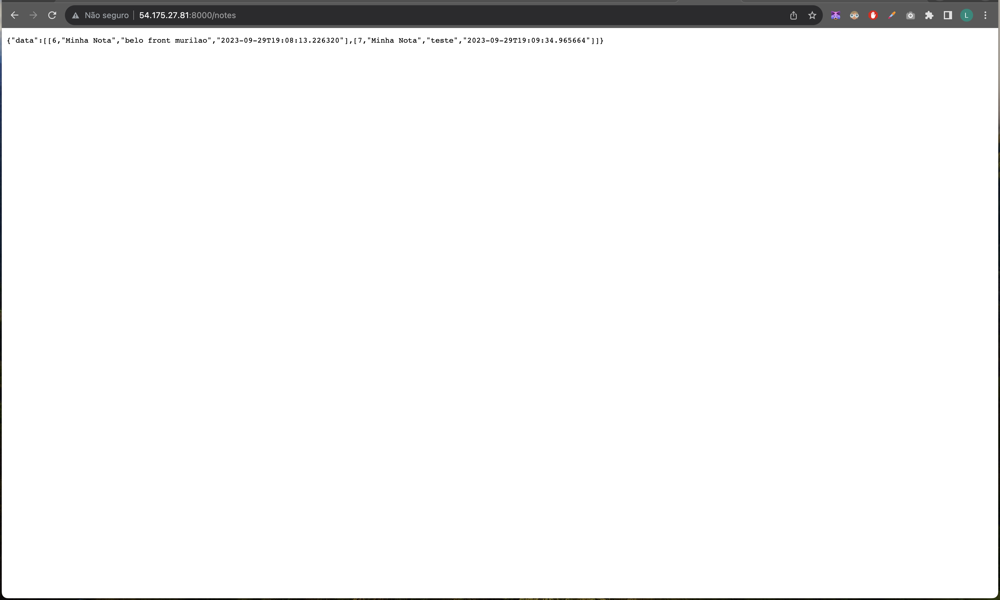
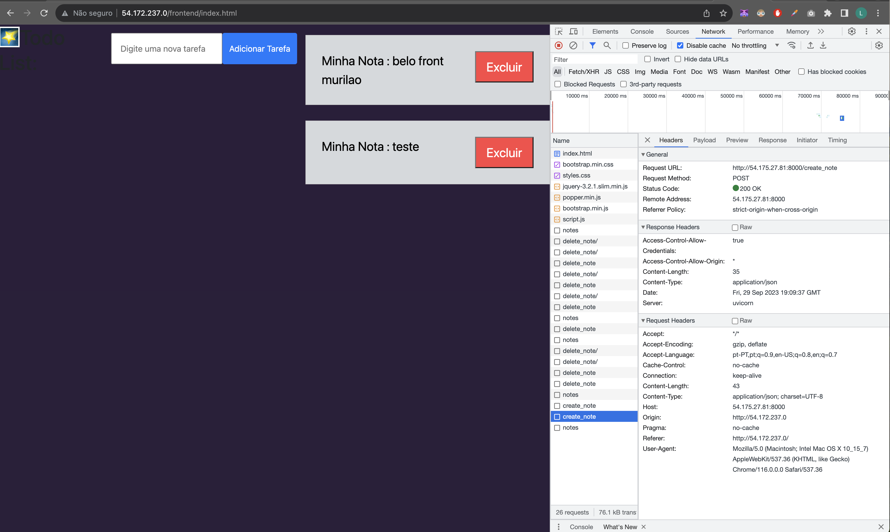
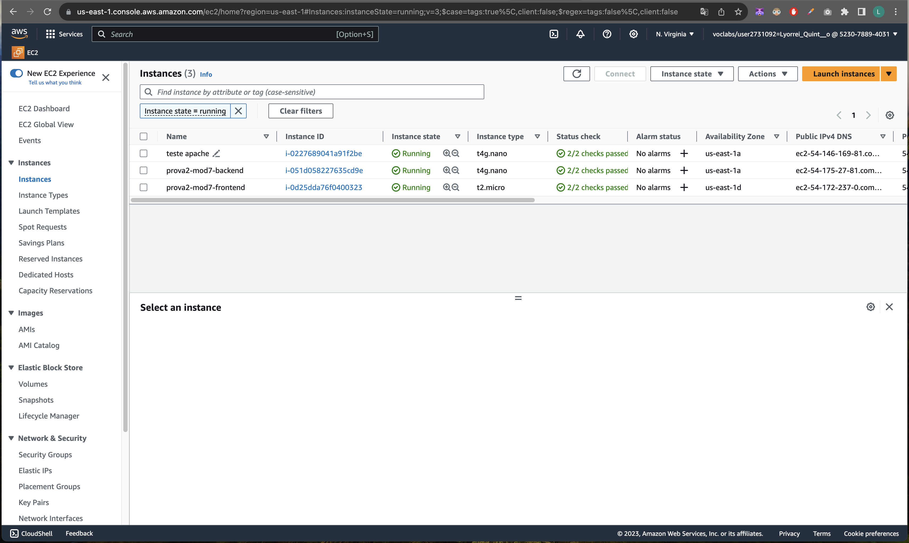
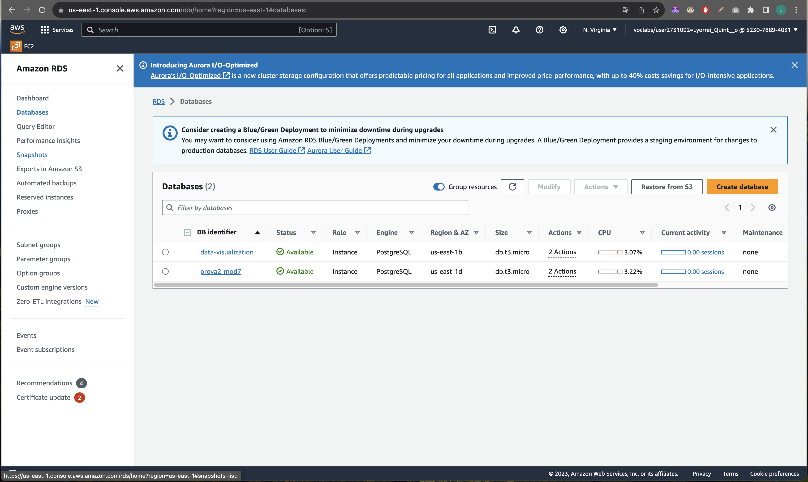

# Relatório
Aqui vou detalhar o passo a passo para colocar todo o sistema (frontend, backend e banco de dados) para funcionar nas aws. 

## RDS
Primeramente, comecei criando um RDS na AWS. Selecionei o "Engyne type" como Postgres e deixei marcado o "Engine version" automaticamente selecionado. Selecionei o Templates como o "Free tier" para não gastar muito dinheiro. Coloquei o "DB instance identifier" como "prova2-mod7". "Master Username" deixei como "postgres". Em senhas, coloquei "minhasenha". Em conectividade marquei "Public Access" como "Yes" para permitir o acesso ao banco de dados e em "VPC Security group" deixei marcado o Default. O resto das opções deixei default. 
Após criado o RDS, fui no Security Group selecionado para ele e abri conexão TCP para a porta 5432 para todos os endereços (0.0.0.0).

## Backend
Primeiramente, mudei os seguintes códigos da backend para as configurações corretas do banco de dados RDS criado:

### main.py
````
  DB_USER = "postgres"
  DB_PASSWORD = "minhasenha"
  DB_HOST = "prova2-mod7.clvym8x1eppf.us-east-1.rds.amazonaws.com"
  DB_PORT = "5432"
  DB_NAME = "postgres"
````

### criar_banco.py
````
  DB_USER = "postgres"
  DB_PASSWORD = "minhasenha"
  DB_HOST = "prova2-mod7.clvym8x1eppf.us-east-1.rds.amazonaws.com"
  DB_PORT = "5432"
  DB_NAME = "postgres"
````

Depois, instalei as dependências localmente e tentei rodar o arquivo criar_banco.py para testar a conexão com o RDS.

````
  cd backend
  python3 criar_banco.py
````

Como o terminal fechou sem nenhum log de erro, assumi que a criação de tabelas foi realizada com sucesso.

### AWS
Depois, naveguei até o serviço de EC2 da AWS e comecei a criar um instância. Vou listar aqui apenas as configurações modificadas:

Name: "prova2-mod7-backend" <br/>
OS Image: Ubuntu <br/>
Architecture: "Arm" <br/>
Key pair: Selecionei um que já havia criado <br/>
Security group: Selecionei um que já havia criado <br/>

Depois, abri a porta 8000 para conexões TCP para todas os endereços (0.0.0.0) nas configurações do security group que havia selecionado.

Depois, subi todo o código que foi atualizado para meu repositório.

Próximo passo foi me conectar a instância EC2 por meio de ssh:
````
  ssh -i ./sec.pem ubuntu@ec2-54-175-27-81.compute-1.amazonaws.com
````

Depois, clonei meu repositório dentro do meu EC2.


````
git clone https://github.com/lyorrei-inteli/prova2_mod7.git
cd prova2_mod7
cd backend/
````

Instalação do pip.
````
sudo apt update
sudo apt install python3-pip
````

Voltamos a executar o backend.
````
pip install -r requirements.txt
python3 main.py
````

Depois, a aplicação foi executada corretamente e pode ser acessada por meio da seguinte url:
http://54.175.27.81:8000/

Tentei acessar a url http://54.175.27.81:8000/notes, porém estava dando status 500. Acabei descobrindo que o script de criar tabelas no banco de dados não tinha funcionado. Por isso, conectei ao db via dbeaver e executei o comando de criação e tabelas. 

Imagem da aplicação rodando:


## Frontend
Primeiramente, adaptei o código no arquivo script.js para apontar para a url correta do backend em todos os lugares que foram necessários:
````
fetch("http://3.95.1.63/notes") -> fetch("http://54.175.27.81:8000/notes")
````
Depois, subi as mudanças para o meu repositório.

Depois, fui criar uma instância EC2 para o frontend

Vou listar aqui apenas as configurações modificadas:

Name: "prova2-mod7-frontend" <br/>
OS Image: Ubuntu <br/>
Architecture: "Arm" <br/>
Key pair: Selecionei um que já havia criado <br/>
Security group: Selecionei um que já havia criado <br/>

Depois, abri a porta 80 para conexões TCP para todas os endereços (0.0.0.0) nas configurações do security group que havia selecionado.

Depois, me conectei via ssh:
````
  ssh -i ./sec.pem ubuntu@ec2-54-172-237-0.compute-1.amazonaws.com
````


Instalei dentro do EC2 o Apache:

```bash
  sudo apt update
  sudo apt upgrade
  sudo apt install apache2

```
E clonei os arquivos frontend do meu repositorio 
````
  git clone https://github.com/lyorrei-inteli/prova2_mod7.git
  
````

Copiei o meu html para dentro da pasta do apache:
````
  sudo cp ./prova2_mod7/frontend /var/www/html
````

Agora, a aplicação é acessível no link http://54.172.237.0/frontend/index.html

Depois, percebi que estava sem estilização. Descobri um erro no código do frontend. Correção:
````
  <link rel="stylesheet" href="style.css"> -> <link rel="stylesheet" href="styles.css">
````

E também mudei a cor da li no arquivo styles.css para #000.

Segue uma imagem do frontend funcionando no EC2 da aws e uma requisição de criar nota realizada com sucesso para a url do backend:



## Outras imagens
Instâncias EC2 do frontend e backend:


Instância RDS:

